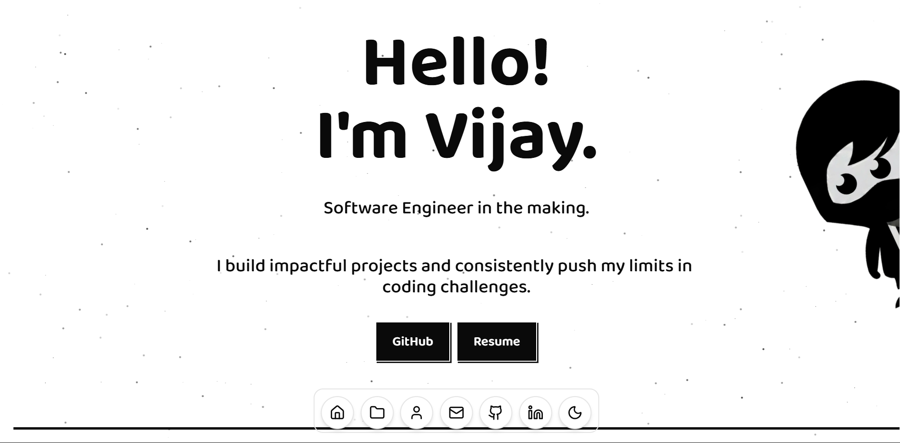

# Portfolio


Portfolio of a Computer Science Student.



## Features

- **Dock Navigation**: Interactive macOS-style dock for smooth navigation.
- **Particle Effects**: Dynamic background particles for visual depth.
- **Horizontal Scroll**: Unique horizontal scrolling interaction for projects.
- **Dark/Light Mode**: Themed interface support.
- **Responsive Design**: Optimized for various screen sizes.

## Getting Started

1.  **Install dependencies**:
    ```bash
    npm install
    ```

2.  **Run the development server**:
    ```bash
    npm run dev
    ```

3.  Open [http://localhost:3000](http://localhost:3000) with your browser to see the result.
